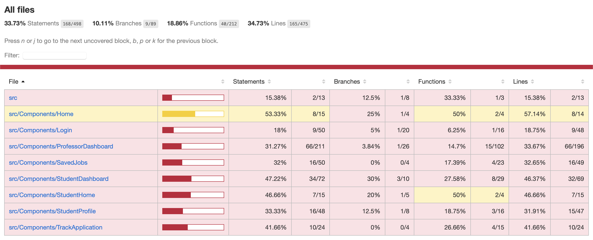

# Edu Setu Application

[](https://github.com/ekanshsinghal/edu-setu-group26-proj2/blob/main/LICENSE)


[](https://zenodo.org/badge/latestdoi/527647386)
[](https://github.com/ekanshsinghal/edu-setu-group26-proj2/actions/workflows/build_test_react.yml)
[](https://app.travis-ci.com/github/jayrajmulani/group1-se-homeworks/pull_requests)
[](https://github.com/ekanshsinghal/edu-setu-group26-proj2/graphs/contributors)
[](https://github.com/ekanshsinghal/edu-setu-group26-proj2/actions/workflows/aws.yml)
[](https://codecov.io/github/ekanshsinghal/se-group26-proj1)

---

## Check it out!

The Edu Setu website is hosted online in AWS and can be accessed by clicking this [link](http://aws-ecs-demo-load-balancer-1697820439.us-east-1.elb.amazonaws.com/).


## Table of Contents

-   [About](#about)
-   [Getting started](#getting-started)
-   [Tech Stack](#development-stack)
    -   [Backend](./code/backend/README.md)
    -   [Frontend](./code/ui/README.md)
-   [Existing Features Overview](https://www.youtube.com/watch?v=2PfVqtwufgw)
-   [New Features and Enhancements](https://github.com/ekanshsinghal/edu-setu-group26-proj2/edit/main/README.md#new-features-and-enhancements)
-   [Documentation](https://github.com/ekanshsinghal/edu-setu-group26-proj2/edit/main/README.md#documentation)
-   [License](#license)
-   [Contributors](https://github.com/ekanshsinghal/edu-setu-group26-proj2/edit/main/README.md#contributors)

---

<a href="https://app.animaker.com/animo/xJq8qgUlHE0MX9wp/"><h2>Intro Video</h2></a>

<p align="center">
  <a href="https://app.animaker.com/animo/xJq8qgUlHE0MX9wp/"></a>
</p>

---

## Why Edu Setu?

"Setu" literally translates to "Bridge" in Hindi.

Our project, Edu-Setu, as the name suggests, is a portal that bridges opportunities and can be immensely helpful in the education domain. We all know how cumbersome it can be to manage emails, segregate the important ones and keeping track of the _Loooooooonnngggggg_ mail chains. Opportunities get buried under these tons and tons of emails.

You might be wondering "what" opportunities exactly? Well, the one that every studnet desires to have and every professor usually need to offer! Yes, Edu-Setu facilitates professors to post opportunities for students which may include, but not liimited to:

-   Research Opportunities
-   Part time roles (On Campus)
-   Project Opportunities
-   Volunteering Opportunities

And, as you might have guessed, students can come in to apply and connect with the professors via this portal. Edu-Setu keeps the track of all the postings and applications, removing the hassle of "emailing" the professor and waiting for the opportunities to get buried.

---

## Getting Started

Like any web application, this project consists of 3 major components. Frontend, Backend and Database.
We have already deployed the backend on Oracle Cloud Infrastructure. So, that includes the _complicated_ Database configuration setup. All you need to do to start using this project is to setup the User Interface. Unfortunately, we couldn't deploy the frontend on the server because of memory limitations on the free-tier account. So, we have the next-best thing in place! Yes, using DOCKER, which means you don't even have to clone the git repo!

---

### Installation

Follow the below steps for installation and local development:

1. [Install docker](https://docs.docker.com/get-docker/), if it's not already installed in your system!
2. Start Docker Desktop and run the container using the below command - Yes, just one command...
3. For backend, go to `/code/backend` and run

```
docker build -t backend .
docker run -p 5000:5000 backend
```

4. For frontend, open another terminal, go to `/code/ui` and run

```
npm install
npm start
```

3. Navigate to [localhost:3000](http://localhost:3000) to your browser.
4. Hit register to create your account
5. Login to begin bridging opportunities!

---

## Tech Stack

### Development Stack


### Deployment Stack


---

## New Features and Enhancements

### Frontend improvements

-   Removed dependencies from 11 libraries in UI => smaller package size => faster load times
-   Added app level state-management and routing to avoid making same API calls repeatedly or reloading the entire webpage => more responsive user experience
-   API calls have been parallelised instead of sequential => lower first load/render times
-   UI over-hall (unified UI design theme across the student & professor portal)
-   Tables are paginated instead 1 single long table, have better filters
-   Saved Jobs Functionality
-   Shortlist candidates functionality for professors
-   Upload and view profile picture
-   Upload resume by student and Download by professor

### Backend improvements

-   API for saving a job
-   API for viewing saved jobs for each student
-   API for storing profile pictures
-   API for retrieving profile pictures
-   API for storing resume pdfs
-   API for retrieving resume pdfs
-   Connectivity with Oracle Cloud Buckets to store uploaded files
-   API for professor to be able to reject every applicant except for the selected candidate (essentially closing the job) in one click
-   API for notifying the students via emails regarding any status update in applications
-   Improved security by using GitHub Secret Manager to secure private keys and other required configurations
-   Moved important configuration variables to environment variables and secured them

### Scalability, Infrastructure, Automation, Cloud related improvements

-   Developed an optimal Cloud infrastructure in AWS to host the application
-   Updated to production grade gunicorn server with 10 workers and 5 threads each which scales the application backend 50 times
-   Dockerized the backend server along with configuration required for AWS deployment
-   Elastic Container Repository to host the Docker Containers for backend and frontend
-   Elastic Container Service with two clusters (EC2 + Networking), services with Load Balancers amd Auto-scaling, and tasks to support Continuous Integraion and Continuous Deployment.
-   Attached Load Balancers in the front to distribute the load among the EC2 servers.
-   Applied Autoscaling policy to horizontally scale upto 20x by dynamically creating additional instances based on CPU Utilization with a threshold of 30%.
-   Implemented CI/CD pipeline using GitHub actions workflow to automate the deployment latest changes in the backend and frontend applications to AWS.
-   Implemented ECR lifecycle policy to delete all images except the latest two in the cloud repository to avoid unnecessary charges due to storage.
-   Automated backend testing using GitHub workflow to test each API after every commit.

### Demo Video

A video explaining the newly added features can be found in this [link](https://drive.google.com/file/d/1SAOqbMNJrZS7wzJ1X1OPpqAk_wSBRjD7/view?usp=sharing)

[](http://www.youtube.com/watch?v=-n5OHN_Oc7I "Video Title")


### How to use the application? - Basic Functionalities Mini Tutorials

#### Student Portal
- Register as a student by providing the required information. Or login if you already created a student profile.
- Once you login you can see the list of all the open job positions posted by various professors.
- You can check on the posting and read the description and prerequisites.
- You can choose to apply for a job or save it for later.
- You also have the option to share the job posting using the sharable URL.
- You can sort by any of the columns just by clicking on the arrow symbols next to the column name.
- You can also apply filters by clicking the filter icon near the column name.
- In the Saved Jobs tab, you can view a list of all the jobs that you have saved for later.
- In the Applications tab, you can see a list of the jobs that you have applied previously along with the status of the application. The status will be updated by the professor after reviewing your application.
- You can also choose to withdraw an application if you no longer wish to be considered for the position.
- In the Profile tab, you can see and update your personal information such as Name, Degree, GPA, Mobile number, etc. 
- You can also set your profile picture. 
- You can upload your resume which will be attached to your job applications and helps the professors to review your profile. Resume can be updated any time.
- Once you are done editing your profile, you can click submit to save the changes.

#### Professor Portal
- Register as a professor by providing the required information. Or login if you already created a professor profile.
- Once you login you can see all the previous job postings that you have posted. 
- You can choose to edit a posting by clicking the edit icon and save it.
- You can delete a posting if it has been filled or not required anymore.
- You have option to search from the list of your previous postings using any keyword.
- You can also add new job postings by clicking the Add Posting button and filling the required details of the new position. Click submit to save. This will be visible to all the students.
- You can see all the applications who have applied for each job posting grouped by the position name. 
- You can also see the number of applicants for each position.
- If you would like to review applications for a specific position, click on the position name to view all applications.
- You will see a list of all the applications along with the student details.
- You can download the student's resume by clicking the Download Resume button.
- If you would like to update the status of a student's application, click the edit icon. Here you can change the Status to Pending, In-progress, Shortlisted, Selected or Rejected. Click submit when done.
- If you select a student for a position, other students will automatically be rejected.
- If you shortlist a student, their application will be moved to the the Shortlisted tab where you can see all your shortlisted applications.
- The students will be notified in real-time via email whenever you update the application for a student.
- You can also view and update your profile under the Profile tab. 

## Documentation

The portal is developed with the above mentioned tech-stack. Detailed documentation for each component can be found as below:

1. [Backend](https://ekanshsinghal.github.io/edu-setu-group26-proj2/)
2. [Frontend](https://github.com/ekanshsinghal/edu-setu-group26-proj2/tree/main/docs/backend)


### CI/CD Pipeline


### Architecture


### Scalability


---


### Code Coverage



---

## License

This project is licensed under [MIT](https://mit-license.org/).

Further details regarding the license can be found [here](https://github.com/jayrajmulani/group1-se-homeworks/blob/main/LICENSE).

---

## Why work on our Project?

<a href="https://app.animaker.com/animo/xJq8qgUlHE0MX9wp/"><h2>Why FORK our project</h2></a>

<p align="center">
  <a href="https://app.animaker.com/animo/U8kmFueXtw7EeXdL/"></a>
</p>

---

## Discord channel link - [Click to join](https://discord.gg/HPFQ3Qak)

## Contributors

<table>

  <tr>
    <td align="center"><a href="https://github.com/rahulrk2303"><br /><sub><b>Rahul Rangarajan Kannan</b></sub></a></td>
    <td align="center"><a href="https://github.com/ekanshsinghal"><br /><sub><b>Ekansh Singhal</b></sub></a></td>
    <td align="center"><a href="https://github.com/gowtham-sathyan"><br /><sub><b>Gowtham Sathyan</b></sub></a></td>
    <td align="center"><a href="https://github.com/sbkrishna123"><br /><sub><b>Supriya Krishna</b></sub></a></td>
  </tr>
  
  <tr>
    <td align="center"><a href="https://github.com/jayrajmulani"><br /><sub><b>Jayraj Mulani</b></sub></a></td>
    <td align="center"><a href="https://github.com/Yashasya"><br /><sub><b>Yashasya Shah</b></sub></a></td>
    <td align="center"><a href="https://github.com/Dhrumil0310"><br /><sub><b>Dhrumil Shah</b></sub></a></td>
    <td align="center"><a href="https://github.com/Harshil47"><br /><sub><b>Harshil Sanghavi</b></sub></a></td>
    <td align="center"><a href="https://github.com/anishasc99"><br /><sub><b>Anisha Chazhoor</b></sub></a></td>
</tr>
</table>
